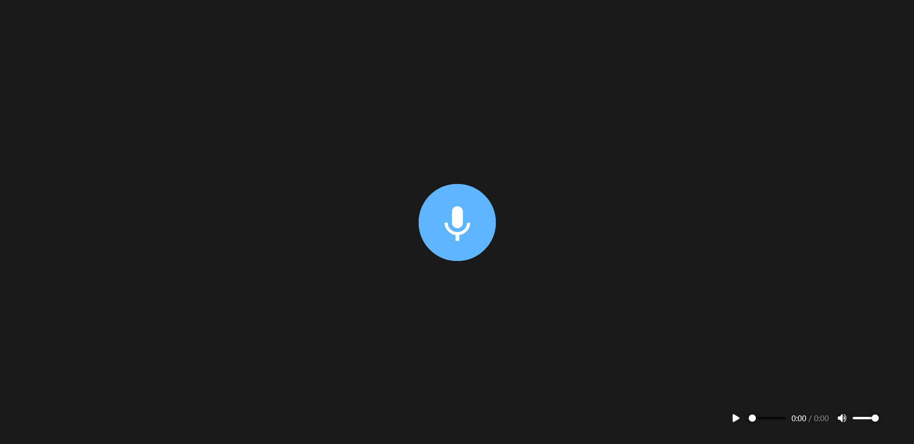

<h1 align="center">🔉 Memo</h1>
<p align="center">🌱 Projeto desenvolvido para gravar e tocar o som do microfone nativamente pelas APIs do browser</p>

<p align="center">
    
    
</p>

## 🛠 Tecnologias usadas

- [Node.js](https://nodejs.org/)
- [http-server](https://github.com/http-party/http-server)

## ⚙️ Como rodar a aplicação

```bash
# Clone este repositório
$ git clone https://github.com/Felipe-Macario/memo-recorder.git

# Instale as dependências
$ npm install

# Inicie a aplicação
$ npm start
```

O servidor iniciará na porta 8080, para acessar a aplicação utilize a url [`http://localhost:8080`](http://localhost:8080) ou a url que vai aparecer no console após o npm start.

### 🚕 Credits
- Projeto seguindo o vídeo do [Erick Wendel](https://www.youtube.com/watch?v=Pd_LS7p_BX4)
- Layout de [Ettrics' CodePen](https://codepen.io/ettrics/pen/KpzzQZ)